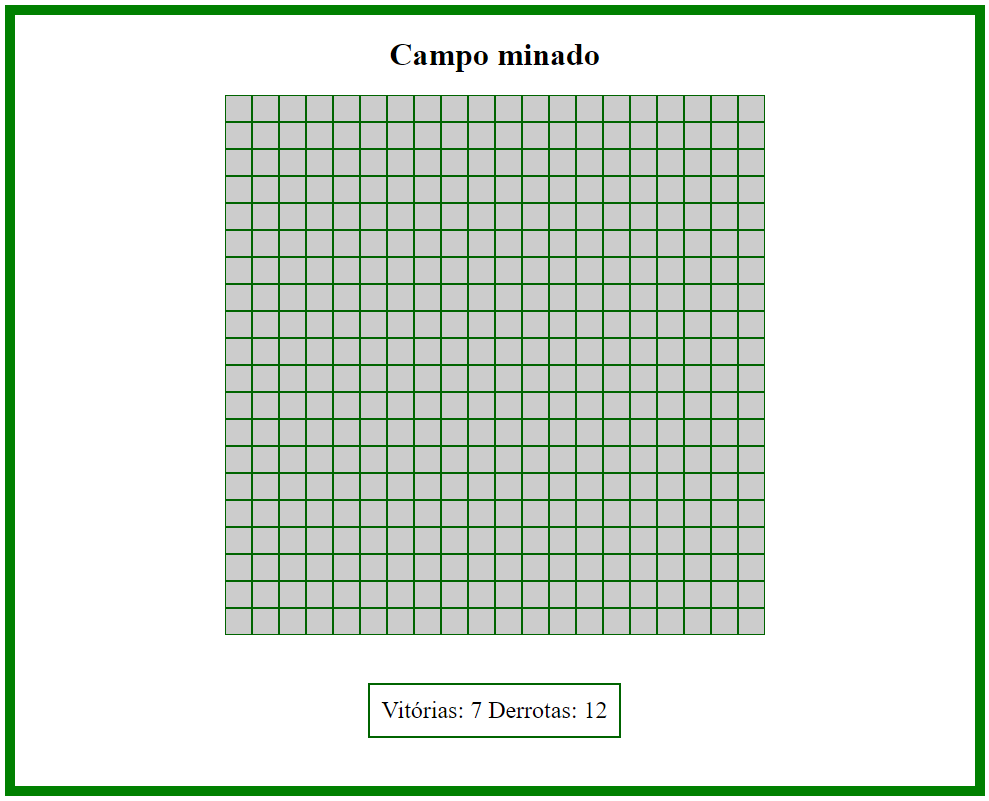

# LetsCode-CampoMinado

Projeto criado por Bruno Couto Mariño e Gabriela Mendes da Rocha Vaz
durante a capacitação proporcionada pelo Banco do Brasil em parceria com a Lets Code em 2022.

O sistema é um jogo de campo minado e salva as vitórias e derrotas no localstorage

   